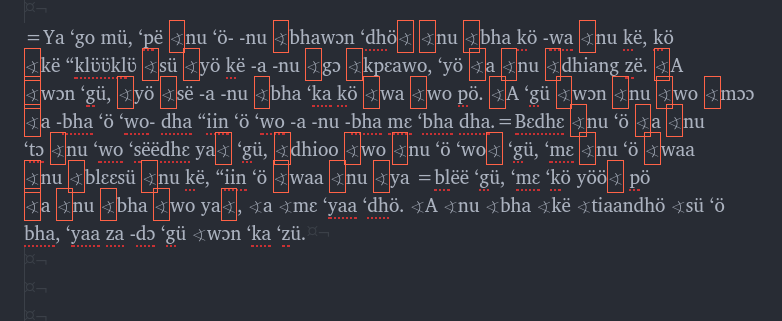

# Character move

## Goal
I have a specific text I am trying to assure is encoded using the correct point locations in Unicode.

Evidence that I have a problem.

```
A kpö gɔɔ =plɛ naa: bhöpë nu ‘ö ‘wo “siʋ̈ ya mɛ kwi ‘gü, ‘ö ‘wo ‘nii da mɛ ‘gü
```

As seen in my text editor:



* **Note**: I do use CharisSIL in my text editor.
*  **Note 2**: I am running CharisSIL 5.000 developer 1 as that is the latest which is in the SIL PPA. I am running linux (ubuntu/wasta 16.04). All software is up-to-date, according to my update managers.

Sample text can be found in the sampe text file `Character conversion test/character-text.txt`

I think that I am trying to target a character in SIL's PUA. I am led to this conclusion because David Rowe when looking at my data for another issue, mentioned that his version of the font CharisSIL showed the characters as inverted block. Suggesting that the PUA character had been moved to the main part of Unicode. I do not know which character was visible to him, as we were in a skype session.

I have three different sources of texts in this language which are showing some sort of character problem (Donation text 1, Donation text 2, and toolbox file 1). This is a sample from _donation text 1_. Find a sample of _donation text 2_ [here](https://github.com/HughP/dnj-corups/blob/master/mass-text.txt).  I think they are all the same problem. But if not, the unit of learning that would be most helpful is how to target the bad acting character....

### Attempted methodologies

I have tried to use SIL's teckit and [UnicodeCCount](http://scripts.sil.org/UnicodeCharacterCount)

My sample files are all in the directory `Character conversion test`.
 I copied one word with the missing grapheme/character to be converted to another text file, saved it in file `smalltext.txt `.

Then I process the file from the command line like so: ` $ txtconv -i smalltext.txt -o smalltext-post-teckit.txt -t SILPUA.tec`

 When I process the output file with UnicodeCCount the only thing registers as a change is that a BOM mark is added. See file: `smalltext-post-teckit.txt `

Output from  `UnicodeCCount`.

Results before:

Codepoint | Grapheme | Count
----|----|----
U+000A |   | 1
U+001E |   | 1
U+0065 | e | 1
U+006B | k | 1
U+0308 |  | 1

Results after:

Codepoint | Grapheme | Count
----|----|----
U+000A |   | 1
U+001E |   | 1
U+0065 | e | 1
U+006B | k | 1
U+0308 |  | 1
U+FEFF |  | 1


**So, how do I correctly ID the character in question?**


### Included in this Repo

* SIL's Teckit PUA converter mapping files sourced from [here](https://github.com/silnrsi/wsresources/tree/master/scripts/Latn/mappings/sil-pua)
* SIL's PUA Description Files
* Example test Files
* Martin's Python code for looking up character attributes in Unicode
* Martin's search and replace python code.

### License and ownership

The content of this repo contains materials from SIL International. These materials are freely shared, but ownership belongs to SIL International. No additional licenses are granted or implied.

Language content for testing are excerpts of owned materials, used here under fair use.
